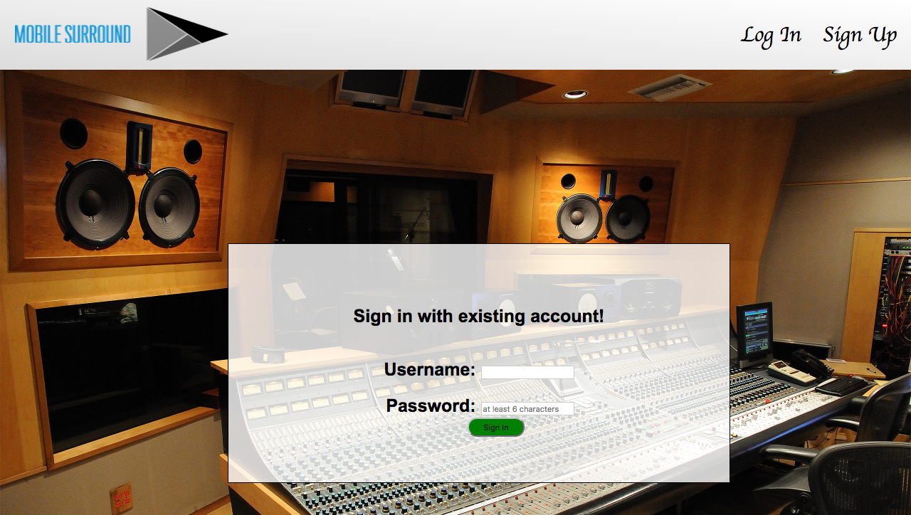
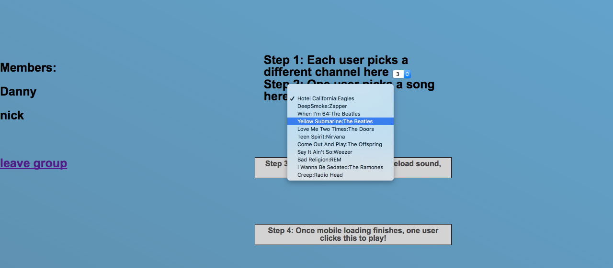
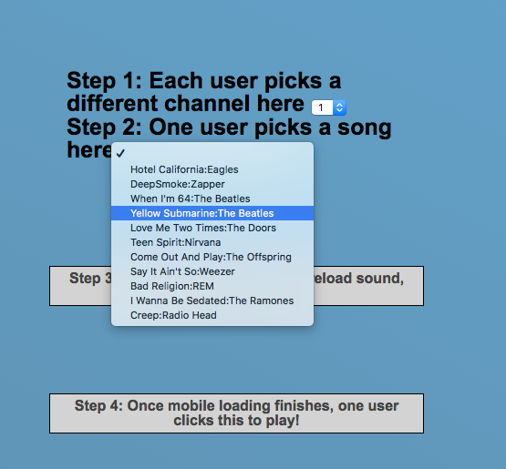
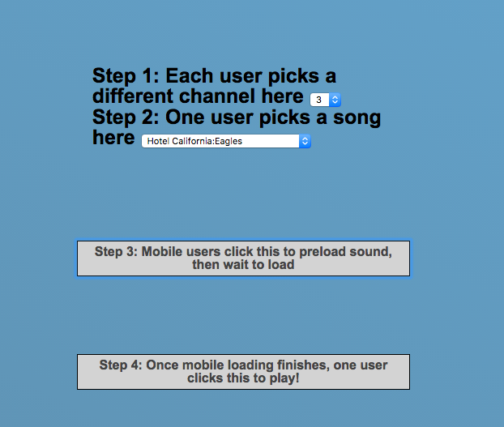

# Mobile Surround

Use the app live here!
![Live] (https://mobile-surround.herokuapp.com)

## Summary
Mobile surround is a web app for mobile devices that takes an audio file (on a rails back-end), down-mixes it into component channels and sends them to a group of iPhones to play surround sound. Users can create new sound groups and upload new sound files on the fly, and create a surround sound environment with nothing but phones. The sound files themselves are hosted using http links and synchrony among a group is established using ActionCable.


## Features

### Feature 1: Auth
Users are greeted by a pleasant login screen where they can log in to their account.



### Feature 2: Sound groups
Users can create new sound groups and then their friends can join.



### Feature 3: Soundfile linking
Users can create new sound file links. Each URL represents a different channel of surround-sound or a different instrument of a split sound.

### Feature 4: Sound coordination
When a sound group member picks a track from the menu, all users in the group are sent a message via ActionCable to download their channel.



```HTML
<label>Step 2: One user picks a track
<% if current_user.id == @sound_group.leader.id || true %>
<select name="tracklist" onchange="
$.ajax({
url: '<%=current_user.sound_group_id%>',
data: {sound_group: {track_id: this.value}},
method: 'patch'
});
">
  <option value="-1"></option>
  <% @tracks.each do |track| %>
    <option value="<%=track.id%>"><%=track.name%></option>
  <% end %>
</select>
</label>
```

### Feature 5: Sound playback
Users can play sound tracks and then other users in the same sound group will all hear them synchronously. Under the hood, a schedule-delay algorithm is used to maximize the synchrony of the sound onset.

### Feature 6: Mobile and laptop compatibility
The app was made with mobile-first styling. But it is compatible with laptop and desktop devices as well.

## Synchrony algorithm
A key technical feature of this app is establishing synchrony of sound onset using ActionCable. Internet latency has unacceptable variability for the functionality we require. Instead, when a user sends a play sound command, a timestamp is taken and sent to the server.

```javascript
window.navigator.geolocation.getCurrentPosition((time) =>
{$.ajax({url: '<%=current_user.sound_group_id%>/play', data: {time: time}})});
```

The rails server receives this message on a custom route and uses ActionCable to send the master timestamp to every member of the SoundGroup.

```ruby

@sound_group = SoundGroup.find(params[:id])
SoundGroupChannel.broadcast_to(@sound_group, scheduled_time:
params[:time] [:timestamp])
```

Finally, each of the clients, when it "receives" the ActionCable signal, appends a fixed amount of time and delays itself until the established master time before executing the playsound function.

```javascript
received: ({scheduled_time}) => {
  let soundPlayer = document.getElementById('sound-player');
  scheduled_time = parseInt(scheduled_time)+200;
  window.navigator.geolocation.getCurrentPosition((time) => {
    time=parseInt(time.timestamp);
    setTimeout(()=>{soundPlayer.play();}, scheduled_time-time);
  });
}
```

### Known bugs/limitations
- Users must follow the instructions on the sound group show page EXACTLY. If more than one user picks a song, if a mobile user fails to click the mobile load button, or if multiple users pick a song, results may be unpredictable. This will be fixed in a future update.



- Mobile-to-mobile and laptop-to-laptop results in good synchrony, but mobile-to-laptop synchrony is mediocre.
- App is very slow and barely functional on iPhone 3 and earlier.

## Future plans
- We intend to remain active with developing MobileSurroud further.
  - Robust response to sound-group-show audio choices.
  - Android functionality.
  - AWS S3 hosting for upload/download.
  - ChannelSplitterNode for down-mixing.
  - React-Native/Mobile build.
  - API-Layer for other apps to use.
  - Blue tooth hand shaking.
  - Blue tooth time sync.
  - Pause/unpause buttons.
  - Add user Avatar/Name/Email etc.
