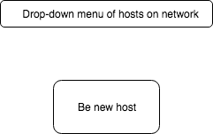

# Mobile Surround

## Background

Single Page application for iPhone that takes an audio file(on a rails back-end), down-mix's it into component channels and serves to users a channel to play. The phones determine a master-slave relationship between them. The master determines to play a song at which point the phones use GPS satellite time to determine a start time with minimal delay/latency. This allows the multiple phones to play a stereo or surround experience.

Trello Link :
https://trello.com/b/x8lJ6aQa/mobile-surround

## Design Docs
- [Time Synchronize](./images/image1.JPG)
- [Component-Hierarchy](./component_hierarchy.md)

## MVP:
- Rails app running a WebView.
- Synchronize time with external source of truth.
- Play same audio file on multiple devices.
- Production readme.
- One device causes song to play on all subscribed to channel.
- Action Cable Functionality.
- Hosted (on heroku or aws.)

## Stretch:
- Play same audio file at same time with negligible offset.
- Share audio file and down-mix by channels.
- Share audio peer to peer/ or server.
- Android functionality.
- React-native-multipeer communication functionality.
- API to allow other apps (games, video players, etc.) to use the program

## WireFrames:

- An initial splash screen to greet users
- 

- A front page where users can choose to be host or client
- 

- The view from the client's perspective. They can choose which speaker they are.
- 

- The view from the host's perspective. They can choose which speaker they are, and additionally can select a song and send a play/pause command to all clients connected.
- 

### Technologies & Technical Challenges
App will be built using react native with a rails backend. We will need to use the following libraries/technologies.

- Audio player.
- Ruby gem in the back-end for audio Down-mixing.
- react-native-multipeer handshake protocol.
- Determining accurate date time.
- Synchronize date time across multiple devices.

### Things we accomplished this weekend.
-  Hello world in react-native.
-  Ping external source of truth(satellite).
    - Synchronize date-time between multiple devices.
    - Function created to find median response from n number of pings to satellite.
    - Asynchronously determine median results.
-  Began work on finding audio library to play sound.
-  Bug fixed development environment.
-  Set up git workflow.

### Group Members & Work Breakdown

Our group consists of two members, Nick Bacon and Daniel Pages.

- Nick:
  - App store hosting.
  - Audio playback.
  - Stereo playback.
  - Handshake protocol.
  - Readme.
  - Git workflow.

- Daniel:
  - Rails server.
  - Time synchronization.
  - Down-mixing on rails backend.
  - Git workflow.
  - App html/css.

## Phase 1: (One day)
- Project init
- Ping external source of truth.(react-native-gps)
- Github init.
- Start react-native app.
- Readme.

## Phase 2: (One day)
- Audio playback.
- Use test stereo audio(https://www.youtube.com/watch?v=4bJ0dvAl98k)

## Phase 3: (One day)
- Peer to peer communication.(react-native-multipeer)
- Peer to peer file-sharing.

## Phase 4: (One day)
- Down-mixing.
- Audio server.

## Phase 5: (One day)
- Create frontend.
- Polish frontend.
- Allow user to choose speaker.
- 4 digit key to allow phones to use database.

## Phase 6: (One day)
- Push to app store.
- App store server.
- Fix remaining bugs.
